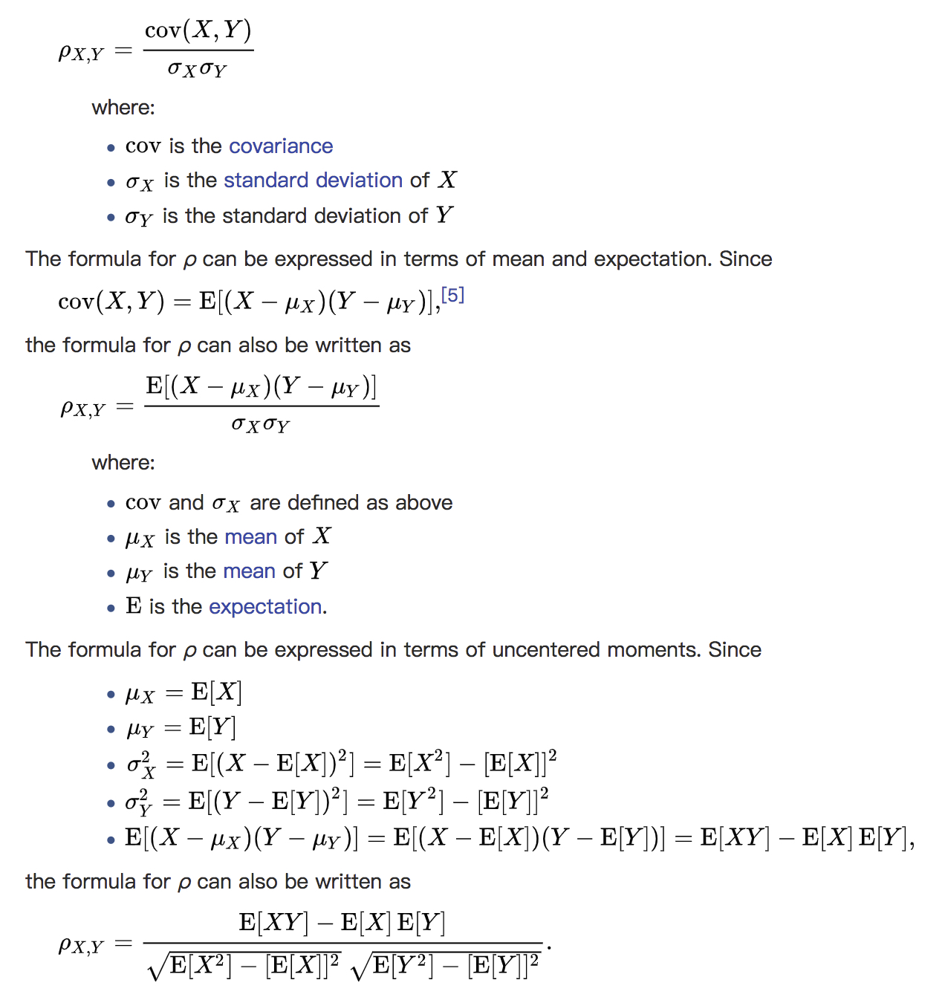
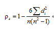
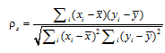
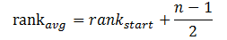

### Correlations 相关性系数
---
#### 概览
统计中，计算两个数据集的相关性是常用操作。在`spark.mllib`中提供了计算数据集中两两相关性的灵活性。目前有`Pearson`相关和`Spearman`相关。

`Statistics`提供方法计算数据集的相关性。根据输入的类型，两个`RDD[Double]`或`RDD[Vector]`，输出是`Double`值或相关性矩阵。
```scala
import org.apache.spark.mllib.linalg._
import org.apache.spark.mllib.stat.Statistics
import org.apache.spark.rdd.RDD

val seriesX: RDD[Double] = sc.parallelize(Array(1, 2, 3, 3, 5))  // a series
// must have the same number of partitions and cardinality as seriesX
val seriesY: RDD[Double] = sc.parallelize(Array(11, 22, 33, 33, 555))

// compute the correlation using Pearson's method. Enter "spearman" for Spearman's method. If a
// method is not specified, Pearson's method will be used by default.
val correlation: Double = Statistics.corr(seriesX, seriesY, "pearson")
println(s"Correlation is: $correlation")

val data: RDD[Vector] = sc.parallelize(
  Seq(
    Vectors.dense(1.0, 10.0, 100.0),
    Vectors.dense(2.0, 20.0, 200.0),
    Vectors.dense(5.0, 33.0, 366.0))
)  // note that each Vector is a row and not a column

// calculate the correlation matrix using Pearson's method. Use "spearman" for Spearman's method
// If a method is not specified, Pearson's method will be used by default.
val correlMatrix: Matrix = Statistics.corr(data, "pearson")
println(correlMatrix.toString)
```
详见`examples/src/main/scala/org/apache/spark/examples/mllib/CorrelationsExample.scala`

conslole:
```
Correlation is: 0.8500286768773001

1.0                 0.9788834658894731  0.9903895695275673  
0.9788834658894731  1.0                 0.9977483233986101  
0.9903895695275673  0.9977483233986101  1.0
```

#### 解析
1 皮尔森相关系数
---
当两个变量的线性关系增强时，相关系数趋于1或-1。正相关时趋于1，负相关时趋于-1。当两个变量独立时相关系统为0，但反之不成立。当Y和X服从联合正态分布时，其相互独立和不相关是等价的。 皮尔森相关系数的计算通过下面代码实现。
<div  align="center"></div>

`PearsonCorrelation`
```scala
 /**
   * Compute the Pearson correlation matrix S, for the input matrix, where S(i, j) is the
   * correlation between column i and j. 0 covariance results in a correlation value of Double.NaN.
   */
  override def computeCorrelationMatrix(X: RDD[Vector]): Matrix = {
    val rowMatrix = new RowMatrix(X)
    val cov = rowMatrix.computeCovariance()//计算协方差矩阵
    computeCorrelationMatrixFromCovariance(cov)
  }

  /**
   * Compute the Pearson correlation matrix from the covariance matrix.
   * 0 variance results in a correlation value of Double.NaN.
   */
  def computeCorrelationMatrixFromCovariance(covarianceMatrix: Matrix): Matrix = {
    val cov = covarianceMatrix.asBreeze.asInstanceOf[BDM[Double]]
    val n = cov.cols

    // Compute the standard deviation on the diagonals first
    var i = 0
    while (i < n) {
      // TODO remove once covariance numerical issue resolved.
      cov(i, i) = if (closeToZero(cov(i, i))) 0.0 else math.sqrt(cov(i, i))
      i +=1
    }

    // Loop through columns since cov is column major
    var j = 0
    var sigma = 0.0
    var containNaN = false
    while (j < n) {
      sigma = cov(j, j)
      i = 0
      while (i < j) {
        val corr = if (sigma == 0.0 || cov(i, i) == 0.0) {
          containNaN = true
          Double.NaN
        } else {
          cov(i, j) / (sigma * cov(i, i))
        }
        cov(i, j) = corr
        cov(j, i) = corr
        i += 1
      }
      j += 1
    }

    // put 1.0 on the diagonals
    i = 0
    while (i < n) {
      cov(i, i) = 1.0
      i +=1
    }

    if (containNaN) {
      logWarning("Pearson correlation matrix contains NaN values.")
    }

    Matrices.fromBreeze(cov)
  }
```
2 斯皮尔曼相关系数
---
使用Person相关系数有两个局限性：
1. 必须假设数据是成对地从正态分布中取得的。
2. 数据至少在逻辑范围内是等距的。
`如果这两条件不符合，一种可能就是采用Spearman秩相关(rank correlation)系数来代替Pearson线性相关系数。`

Spearman秩相关系数通常被认为是排列后的变量之间的Pearson线性相关系数，在实际计算中，有更简单的计算ρs的方法。假设原始的数据xi，yi已经按从大到小的顺序排列，记x’i，y’i为原xi，yi在排列后数据所在的位置，则x’i，y’i称为变量x’i，y’i的秩次，则di=x’i-y’i为xi，yi的秩次之差。

如果没有相同的秩次，则ρs可由下式计算:
<div  align="center"></div>

如果有相同的秩次存在，那么就需要计算秩次之间的Pearson的线性相关系数
<div  align="center"></div>

```scala
 /**
   * Compute Spearman's correlation matrix S, for the input matrix, where S(i, j) is the
   * correlation between column i and j.
   */
  override def computeCorrelationMatrix(X: RDD[Vector]): Matrix = {
    //zipWithUniqueId: Items in the kth partition will get ids k, n+k, 2*n+k, ..., where n is the number of partitions
    // ((columnIndex, value), rowUid)
    val colBased = X.zipWithUniqueId().flatMap { case (vec, uid) =>
      vec.toArray.view.zipWithIndex.map { case (v, j) =>
        ((j, v), uid)
      }
    }
    // 通过(columnIndex, value)全局排序，将相似(columnIndex, value) SHUFFLE 进同一个partition，以方便进一步mapPartitions
    // global sort by (columnIndex, value)
    val sorted = colBased.sortByKey()
    // assign global ranks (using average ranks for tied values)
    //(uid, (preCol, averageRank))
    val globalRanks = sorted.zipWithIndex().mapPartitions { iter =>
      var preCol = -1
      var preVal = Double.NaN
      var startRank = -1.0
      val cachedUids = ArrayBuffer.empty[Long]
      val flush: () => Iterable[(Long, (Int, Double))] = () => {
        val averageRank = startRank + (cachedUids.size - 1) / 2.0
        val output = cachedUids.map { uid =>
          (uid, (preCol, averageRank))
        }
        cachedUids.clear()
        output
      }
      iter.flatMap { case (((j, v), uid), rank) =>
        // If we see a new value or cachedUids is too big, we flush ids with their average rank.
        if (j != preCol || v != preVal || cachedUids.size >= 10000000) {
          val output = flush()
          preCol = j
          preVal = v
          startRank = rank
          cachedUids += uid
          output
        } else {
          cachedUids += uid
          Iterator.empty
        }
      } ++ flush()
    }
    // Replace values in the input matrix by their ranks compared with values in the same column.
    // Note that shifting all ranks in a column by a constant value doesn't affect result.
    //(uid, (preCol, averageRank)) ==> groupByKey,根据uid(m*n+k)分组，相当于"恢复"到colBased.sortByKey()之前、向量 X 的partition，
    val groupedRanks = globalRanks.groupByKey().map { case (uid, iter) =>
      // sort by column index and then convert values to a vector
      // 在向量 X 的partition，根据columnIndex排序，相当于把向量 X 的值改为rank值 
      Vectors.dense(iter.toSeq.sortBy(_._1).map(_._2).toArray)
    }
    PearsonCorrelation.computeCorrelationMatrix(groupedRanks)//计算Pearson相关性
  }
```
在每个分区内部，对于列索引相同且值相同的数据对，我们为其分配平均rank值。平均rank的计算方式如下面公式所示：
<div  align="left"></div>
其中rank_start表示列索引相同且值相同的数据对在分区中第一次出现时的索引位置，n表示列索引相同且值相同的数据对出现的次数。

