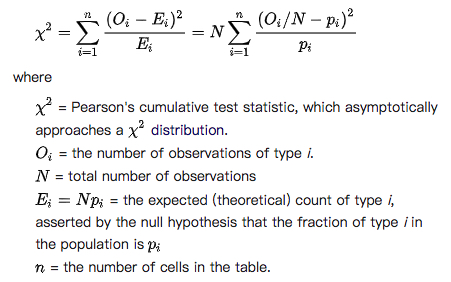
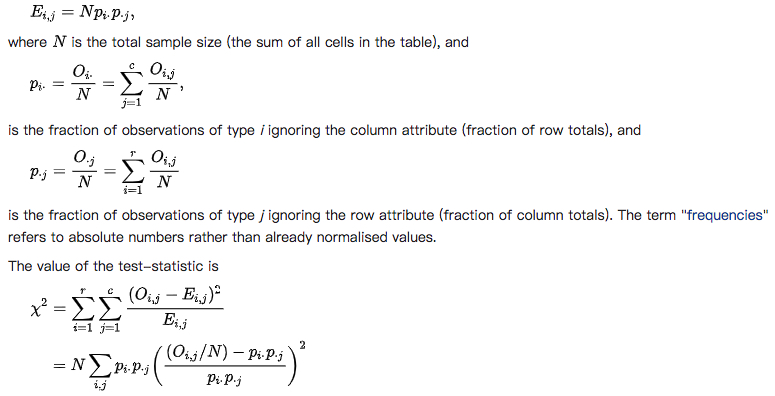
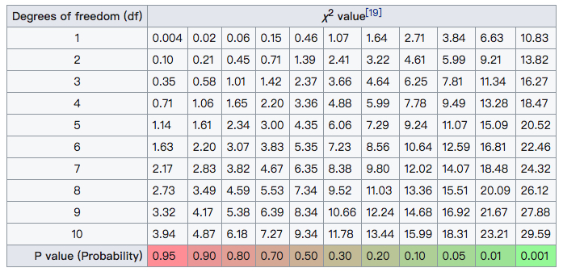

### Hypothesis testing 假设检验
---
假设检验是统计中的强力武器，决定结果是否统计有效、结果是否可能发生。`spark.mllib`当前支持皮尔森卡方检验(Pearson’s chi-squared ( χ2) tests ),具有适配度检测和独立性检测(goodness of fit and independence)。输入数据类型决定支持适配度检测或独立性检测。适配度检测需要输入`Vector`型数据，独立性检测需要`Matrix`型数据。

- 适配度检测: 输入 `Vector`
- 独立性检测: 输入 `Matrix`

`spark.mllib`也支持输入`RDD[LabeledPoint]`启用卡方独立性检测来进行特征选择。

```scala
import org.apache.spark.{SparkConf, SparkContext}
// $example on$
import org.apache.spark.mllib.linalg._
import org.apache.spark.mllib.regression.LabeledPoint
import org.apache.spark.mllib.stat.Statistics
import org.apache.spark.mllib.stat.test.ChiSqTestResult
import org.apache.spark.rdd.RDD
// $example off$

object HypothesisTestingExample {

  def main(args: Array[String]) {

    val conf = new SparkConf().setAppName("HypothesisTestingExample").setMaster("local")
    val sc = new SparkContext(conf)

    // $example on$
    // a vector composed of the frequencies of events
    val vec: Vector = Vectors.dense(5, 8, 9, 8, 10, 20)//(0.1, 0.15, 0.2, 0.3, 0.25)
    
    // compute the goodness of fit. If a second vector to test against is not supplied
    // as a parameter, the test runs against a uniform distribution.
    val goodnessOfFitTestResult = Statistics.chiSqTest(vec)
    // summary of the test including the p-value, degrees of freedom, test statistic, the method
    // used, and the null hypothesis.
    println(s"$goodnessOfFitTestResult\n")

    val vec1: Vector = Vectors.dense(0.1, 0.15, 0.2, 0.3, 0.25)
    val goodnessOfFitTestResult1 = Statistics.chiSqTest(vec1)
    println(s"$goodnessOfFitTestResult1\n")


    // a contingency matrix. Create a dense matrix ((1.0, 2.0), (3.0, 4.0), (5.0, 6.0))
    val mat: Matrix = Matrices.dense(3, 2, Array(1.0, 3.0, 5.0, 2.0, 4.0, 6.0))

    // conduct Pearson's independence test on the input contingency matrix
    val independenceTestResult = Statistics.chiSqTest(mat)
    // summary of the test including the p-value, degrees of freedom
    println(s"$independenceTestResult\n")


    val obs: RDD[LabeledPoint] =
      sc.parallelize(
        Seq(
          LabeledPoint(1.0, Vectors.dense(1.0, 0.0, 3.0)),
          LabeledPoint(1.0, Vectors.dense(1.0, 2.0, 0.0)),
          LabeledPoint(-1.0, Vectors.dense(-1.0, 0.0, -0.5)
          )
        )
      ) // (feature, label) pairs.

    // The contingency table is constructed from the raw (feature, label) pairs and used to conduct
    // the independence test. Returns an array containing the ChiSquaredTestResult for every feature
    // against the label.
    val featureTestResults: Array[ChiSqTestResult] = Statistics.chiSqTest(obs)
    featureTestResults.zipWithIndex.foreach { case (k, v) =>
      println(s"Column ${(v + 1)} :")
      println(k)
    }  // summary of the test
    // $example off$

    sc.stop()
  }
}
```
console
```text
Chi squared test summary:
method: pearson
degrees of freedom = 5 
statistic = 13.4 
pValue = 0.019905220334774265 
Strong presumption against null hypothesis: observed follows the same distribution as expected..

Chi squared test summary:
method: pearson
degrees of freedom = 4 
statistic = 0.12499999999999999 
pValue = 0.998126379239318 
No presumption against null hypothesis: observed follows the same distribution as expected..

Chi squared test summary:
method: pearson
degrees of freedom = 2 
statistic = 0.14141414141414144 
pValue = 0.931734784568187 
No presumption against null hypothesis: the occurrence of the outcomes is statistically independent..

Column 1 :
Chi squared test summary:
method: pearson
degrees of freedom = 1 
statistic = 3.0000000000000004 
pValue = 0.08326451666354884 //列值与特征独立(没有相关性)
Low presumption against null hypothesis: the occurrence of the outcomes is statistically independent..
Column 2 :
Chi squared test summary:
method: pearson
degrees of freedom = 1 
statistic = 0.75 
pValue = 0.3864762307712326 
No presumption against null hypothesis: the occurrence of the outcomes is statistically independent..
Column 3 :
Chi squared test summary:
method: pearson
degrees of freedom = 2 
statistic = 3.0 
pValue = 0.22313016014843035 
No presumption against null hypothesis: the occurrence of the outcomes is statistically independent..
```
名词解释：
- 虚无假设(0假设，`null hypothesis`,H0): 一个样本中已发生事件的次数分配会遵守某个特定的理论分配,所有事件总机率等于1
- 适合度检验(`Goodness fo fit`): 验证一组观察值的次数分配是否异于理论上的分配
- 独立性检验(`Indenpendence`): 验证从两个变量抽出的配对观察值组是否互相独立（例如：每次都从A国和B国各抽一个人，看他们的反应是否与国籍无关）。
- 自由度(`degrees of freedom`): 自由度。表示可自由变动的样本观测值的数目

不管哪个检验都包含三个步骤：

1. 计算卡方检验的统计值“χ2”：把每一个观察值和理论值的差做平方后、除以理论值、再累加。
2. 计算 χ2 统计值的自由度“df”。
3. 依据研究者设定的置信水准，查出自由度为 df 的卡方分配临界值，比较它与第1步骤得出的 χ2 统计值，推论能否拒绝虚无假设(**_`p值够小，才可拒绝`_**,pValue一般选`0.01 or 0.05`)。

适配度检验：
<div  align="center"></div>
独立性检验:
<div  align="center"></div>

关于自由度，可参阅[用可视化思维解读统计自由度](https://www.jianshu.com/p/0032087b9dbb) 和 [自由度 (统计学)](https://zh.wikipedia.org/wiki/%E8%87%AA%E7%94%B1%E5%BA%A6_(%E7%BB%9F%E8%AE%A1%E5%AD%A6))

关于`χ2`与`df`到`pValue`转化，可参阅[Chi-squared_distribution](https://en.wikipedia.org/wiki/Chi-squared_distribution),如下图:
<div  align="center"></div>
一般以pValue < 0.05 为显著， P<0.01 为非常显著，其含义是样本间的差异由抽样误差所致的概率小于0.05 或0.01

了解以上三个名词，再来看`console`的输出，
- `method: pearson`: 采用pearson方法
- `degrees of freedom`: 自由度。表示可自由变动的样本观测值的数目
- `statistic`: χ2
- `pValue`: p值
- `** presumption against null hypothesis:***`有多么拒绝虚无假设，
    - ** : No, Low, Strong，Very strong等
    - ***:
        - 独立性: `the occurrence of the outcomes is statistically independent..`
        - 适配度: `observed follows the same distribution as expected..`

入参为`Vector`、`Matrix`时，好解释。

入参为`RDD[LabeledPoint]`时，把特征数据中的每一列都与标签进行独立性检验


### 参考
---
[1] [皮尔森卡方检验](https://zh.wikipedia.org/wiki/%E7%9A%AE%E7%88%BE%E6%A3%AE%E5%8D%A1%E6%96%B9%E6%AA%A2%E5%AE%9A)

[2] [Pearson's_chi-squared_test](https://en.wikipedia.org/wiki/Pearson%27s_chi-squared_test#Examples)

[3] [Chi-squared_distribution](https://en.wikipedia.org/wiki/Chi-squared_distribution)

[4] [厦门大学-赖永炫 基本的统计工具（2） - spark.mllib](http://mocom.xmu.edu.cn/article/show/584d1fc5bd8177b41ebbd8bc/0/1)


### Kolmogorov-Smirnov检验
---
另外，`spark.mllib`提供了`Kolmogorov-Smirnov (KS) test`的`1-sample`、`2-sided`实现，检测概率分布的相等性。通过提供理论分布(当前只支持正太分布)的名字和参数，或者一个计算给定理论分布的累计分布的函数(a function to calculate the cumulative distribution according to a given theoretical distribution)。用户可以测试`虚无假设/0假设 null hypothesis`的样本是否来自于这个分布(the user can test the null hypothesis that their sample is drawn from that distribution.)。在这种场景下，用户检验正太分布 (distName="norm"),但是不提供分布参数，检验初始化为标准正太分布并且记录适当的信息。

`Statistics`提供方法运行`1-sample`、`2-sided`KS检验(Kolmogorov-Smirnov test)。
```scala
import org.apache.spark.{SparkConf, SparkContext}
// $example on$
import org.apache.spark.mllib.stat.Statistics
import org.apache.spark.rdd.RDD
// $example off$

object HypothesisTestingKolmogorovSmirnovTestExample {

  def main(args: Array[String]): Unit = {

    val conf = new SparkConf().setAppName("HypothesisTestingKolmogorovSmirnovTestExample").setMaster("local")
    val sc = new SparkContext(conf)

    // $example on$
    val data: RDD[Double] = sc.parallelize(Seq(0.1, 0.15, 0.2, 0.3, 0.25))  // an RDD of sample data

    // run a KS test for the sample versus a standard normal distribution
    val testResult = Statistics.kolmogorovSmirnovTest(data, "norm", 0, 1)
    // summary of the test including the p-value, test statistic, and null hypothesis if our p-value
    // indicates significance, we can reject the null hypothesis.
    println(testResult)
    println()

    // perform a KS test using a cumulative distribution function of our making
    val myCDF = Map(0.1 -> 0.2, 0.15 -> 0.6, 0.2 -> 0.05, 0.3 -> 0.05, 0.25 -> 0.1)
    val testResult2 = Statistics.kolmogorovSmirnovTest(data, myCDF)
    println(testResult2)
    // $example off$

    sc.stop()
  }
}
```
详见`examples/src/main/scala/org/apache/spark/examples/mllib/HypothesisTestingKolmogorovSmirnovTestExample.scala`

console
```text
Kolmogorov-Smirnov test summary:
degrees of freedom = 0 
statistic = 0.539827837277029 
pValue = 0.06821463111921133 
Low presumption against null hypothesis: Sample follows theoretical distribution.

Kolmogorov-Smirnov test summary:
degrees of freedom = 0 
statistic = 0.95 
pValue = 6.249999999763389E-7 
Very strong presumption against null hypothesis: Sample follows theoretical distribution.
```

### [流式显著性检测](streaming-significance-testing.md)


