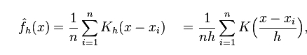
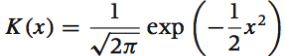
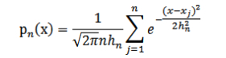

### Kernel density estimation 核密度估计
---
#### 简介
[核密度估计](https://en.wikipedia.org/wiki/Kernel_density_estimation)，根据已知的样本估计未知的密度，属于非参数检验方法之一。核密度估计的原理是:观察某一事物的已知分布，如果某一个数在观察中出现了，可认为这个数的概率密度很大，和这个数比较近的数的概率密度也会比较大，而那些离这个数远的数的概率密度会比较小。
公式为:
<div  align="center"></div>

`K`为核函数(非负、积分为1，符合概率密度性质，并且均值为0),`h`为带宽(或窗宽)

`spark mllib`中，核函数取高斯核，高斯曲线公式为:
<div  align="center"></div>
所以，高斯核密度估计函数为:
<div  align="center"></div>

```scala
import org.apache.spark.{SparkConf, SparkContext}
// $example on$
import org.apache.spark.mllib.stat.KernelDensity
import org.apache.spark.rdd.RDD
// $example off$

object KernelDensityEstimationExample {

  def main(args: Array[String]): Unit = {

    val conf = new SparkConf().setAppName("KernelDensityEstimationExample").setMaster("local")
    val sc = new SparkContext(conf)

    // $example on$
    // an RDD of sample data
    val data: RDD[Double] = sc.parallelize(Seq(1, 1, 1, 2, 3, 4, 5, 5, 6, 7, 8, 9, 9))

    // Construct the density estimator with the sample data and a standard deviation
    // for the Gaussian kernels
    val kd = new KernelDensity()
      .setSample(data)
      .setBandwidth(3.0)

    // Find density estimates for the given values
    val densities = kd.estimate(Array(-1.0, 2.0, 5.0))
    // $example off$

    densities.foreach(println)

    sc.stop()
  }
}
```
console
```text
0.04145944023341911
0.07902016933085627
0.08962920127312336
```

```scala
 /**
   * Estimates probability density function at the given array of points.
   */
  @Since("1.4.0")
  def estimate(points: Array[Double]): Array[Double] = {
    val sample = this.sample
    val bandwidth = this.bandwidth

    require(sample != null, "Must set sample before calling estimate.")

    val n = points.length
    // This gets used in each Gaussian PDF computation, so compute it up front
    val logStandardDeviationPlusHalfLog2Pi = math.log(bandwidth) + 0.5 * math.log(2 * math.Pi)
    val (densities, count) = sample.aggregate((new Array[Double](n), 0L))(
      (x, y) => {
        var i = 0
        while (i < n) {
          x._1(i) += normPdf(y, bandwidth, logStandardDeviationPlusHalfLog2Pi, points(i))
          i += 1
        }
        (x._1, x._2 + 1)
      },
      (x, y) => {
        //daxpy函数的作用是将一个向量加上另一个向量的值，即：dy[i]+=da*dx[i]，其中da为常数
        blas.daxpy(n, 1.0, y._1, 1, x._1, 1)
        (x._1, x._2 + y._2)
      })
    //在向量上乘一个常数
    blas.dscal(n, 1.0 / count, densities, 1)
    densities
  }
  
private object KernelDensity {

  //计算核函数为高斯分布的概率密度函数
  /** Evaluates the PDF of a normal distribution. */
  def normPdf(
      mean: Double,
      standardDeviation: Double,
      logStandardDeviationPlusHalfLog2Pi: Double,
      x: Double): Double = {
    val x0 = x - mean
    val x1 = x0 / standardDeviation
    val logDensity = -0.5 * x1 * x1 - logStandardDeviationPlusHalfLog2Pi
    math.exp(logDensity)
  }
}
```


[1] [核密度估计（kernel density estimation）](http://lotabout.me/2018/kernel-density-estimation/)

[2] [数据常青藤 核密度估计Kernel Density Estimation(KDE)](http://www.dataivy.cn/blog/%E6%A0%B8%E5%AF%86%E5%BA%A6%E4%BC%B0%E8%AE%A1kernel-density-estimation_kde/)

[3] [非参数估计：核密度估计KDE](https://blog.csdn.net/pipisorry/article/details/53635895)

[4] [spark - Kernel density estimation](http://spark.apache.org/docs/latest/mllib-statistics.html#kernel-density-estimation)

[5] [endymecy's github](https://github.com/endymecy/spark-ml-source-analysis/blob/master/%E5%9F%BA%E6%9C%AC%E7%BB%9F%E8%AE%A1/kernel-density-estimation.md)

[6] [厦门大学-基本的统计工具（2） - spark.mllib](http://mocom.xmu.edu.cn/article/show/584d1fc5bd8177b41ebbd8bc/0/1)

