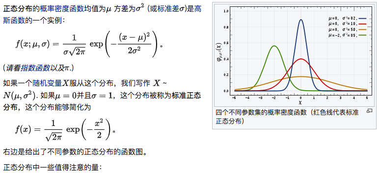

### Random data generation 随机数生成

#### 简介
随机数生成，在随机算法、原型(prototyping)、性能测试中很有用。`spark.mllib`支持生成随机RDD，RDD的` i.i.d. values`来自于给定的分布:均匀分布、标准正太分布、泊松分布(uniform, standard normal, or Poisson.)

`RandomRDDs`提供工厂方法生成随机double RDDs 或 vector RDDs。以下案例生成随机double RDD，它的值服从标准正太分布`N(0, 1)`,然后映射到`N(1, 4)`
```scala
import org.apache.spark.SparkContext
import org.apache.spark.mllib.random.RandomRDDs._

val sc: SparkContext = ...

// Generate a random double RDD that contains 1 million i.i.d. values drawn from the
// standard normal distribution `N(0, 1)`, evenly distributed in 10 partitions.
//  生成1000000个服从正态分配N(0,1)的RDD[Double]，并且分布在 10 个分区中
val u = normalRDD(sc, 1000000L, 10)
// Apply a transform to get a random double RDD following `N(1, 4)`.
// 把生成的随机数转化成N(1,4) 正态分布
val v = u.map(x => 1.0 + 2.0 * x)
v.take(5).foreach(println)
```
console
```text
2.3773282636500435
-3.1977523223033204
3.317517817879228
2.5317479436385444
2.6526840335735447
```
以上为官网示例

以下为bin包里的示例

```scala
package org.apache.spark.examples.mllib

import org.apache.spark.{SparkConf, SparkContext}
import org.apache.spark.mllib.random.RandomRDDs
import org.apache.spark.rdd.RDD

object RandomRDDGeneration {

  def main(args: Array[String]) {

    val conf = new SparkConf().setAppName(s"RandomRDDGeneration").setMaster("local")
    val sc = new SparkContext(conf)

    val numExamples = 10000 // number of examples to generate
    val fraction = 0.1 // fraction of data to sample

    // Example: RandomRDDs.normalRDD
    val normalRDD: RDD[Double] = RandomRDDs.normalRDD(sc, numExamples)
    println(s"Generated RDD of ${normalRDD.count()}" +
      " examples sampled from the standard normal distribution")
    println("  First 5 samples:")
    normalRDD.take(5).foreach( x => println(s"    $x") )

    // Example: RandomRDDs.normalVectorRDD
    val normalVectorRDD = RandomRDDs.normalVectorRDD(sc, numRows = numExamples, numCols = 2)
    println(s"Generated RDD of ${normalVectorRDD.count()} examples of length-2 vectors.")
    println("  First 5 samples:")
    normalVectorRDD.take(5).foreach( x => println(s"    $x") )

    println()

    sc.stop()
  }

}
```
console
```text
Generated RDD of 10000 examples sampled from the standard normal distribution
  First 5 samples:
    0.8241839639816105
    0.5020887737792052
    0.3698313500859245
    -0.15760773859684682
    0.7785335989621256
    
Generated RDD of 10000 examples of length-2 vectors.
  First 5 samples:
    [-0.5651007485027268,-0.06351614534720305]
    [-0.40678775271319767,-0.7803638982689272]
    [-0.8649392982696187,-2.0269659124926185]
    [-1.007061750302515,-0.05030556840147083]
    [-0.7738875459250691,0.41244911335964196]
```

#### 浅析
对于`RandomRDDs.normalRDD`，
```scala
 /**
   * 标准正太分布X ~ N(0, 1)
   * Generates an RDD comprised of `i.i.d.` samples from the standard normal distribution.
   * 
   * To transform the distribution in the generated RDD from standard normal to some other normal
   * `N(mean, sigma^2^)`, use `RandomRDDs.normalRDD(sc, n, p, seed).map(v => mean + sigma * v)`.
   * N(0, 1) => N(mean, sigma^2^) = RandomRDDs.normalRDD(sc, n, p, seed).map(v => mean + sigma * v)
   * @param sc SparkContext used to create the RDD.
   * @param size Size of the RDD.
   * @param numPartitions Number of partitions in the RDD (default: `sc.defaultParallelism`).
   * @param seed Random seed (default: a random long integer).
   * @return RDD[Double] comprised of `i.i.d.` samples ~ N(0.0, 1.0).
   */
  @Since("1.1.0")
  def normalRDD(
      sc: SparkContext,
      size: Long,
      numPartitions: Int = 0,
      seed: Long = Utils.random.nextLong()): RDD[Double] = {
    //Generates i.i.d. samples from the standard normal distribution
    val normal = new StandardNormalGenerator()
    randomRDD(sc, normal, size, numPartitionsOrDefault(sc, numPartitions), seed)
  }
  
 /**
   * :: DeveloperApi ::
   * Generates an RDD comprised of `i.i.d.` samples produced by the input RandomDataGenerator.
   *
   * @param sc SparkContext used to create the RDD.
   * @param generator RandomDataGenerator used to populate the RDD.
   * @param size Size of the RDD.
   * @param numPartitions Number of partitions in the RDD (default: `sc.defaultParallelism`).
   * @param seed Random seed (default: a random long integer).
   * @return RDD[T] comprised of `i.i.d.` samples produced by generator.
   */
  @DeveloperApi
  @Since("1.1.0")
  def randomRDD[T: ClassTag](
      sc: SparkContext,
      generator: RandomDataGenerator[T],
      size: Long,
      numPartitions: Int = 0,
      seed: Long = Utils.random.nextLong()): RDD[T] = {
    //构造RandomRDD
    new RandomRDD[T](sc, size, numPartitionsOrDefault(sc, numPartitions), generator, seed)
  }
```
重点看`StandardNormalGenerator`
```scala
/**
 * :: DeveloperApi ::
 * Generates i.i.d. samples from the standard normal distribution.
 */
@DeveloperApi
@Since("1.1.0")
class StandardNormalGenerator extends RandomDataGenerator[Double] {

  // XORShiftRandom for better performance. Thread safety isn't necessary here.
  // XORShiftRandom 性能更好，线程安全就不能保证
  private val random = new XORShiftRandom()

  @Since("1.1.0")
  override def nextValue(): Double = {
      random.nextGaussian()
  }

  @Since("1.1.0")
  override def setSeed(seed: Long): Unit = random.setSeed(seed)

  @Since("1.1.0")
  override def copy(): StandardNormalGenerator = new StandardNormalGenerator()
}

/**
 * This class implements a XORShift random number generator algorithm
 * Source:
 * Marsaglia, G. (2003). Xorshift RNGs. Journal of Statistical Software, Vol. 8, Issue 14.
 * @see <a href="http://www.jstatsoft.org/v08/i14/paper">Paper</a>
 * This implementation is approximately 3.5 times faster than
 * {@link java.util.Random java.util.Random}, partly because of the algorithm, but also due
 * to renouncing thread safety. JDK's implementation uses an AtomicLong seed, this class
 * uses a regular Long. We can forgo thread safety since we use a new instance of the RNG
 * for each thread.
 */
private[spark] class XORShiftRandom(init: Long) extends JavaRandom(init) {

  def this() = this(System.nanoTime)

  private var seed = XORShiftRandom.hashSeed(init)

  // we need to just override next - this will be called by nextInt, nextDouble,
  // nextGaussian, nextLong, etc.
  override protected def next(bits: Int): Int = {
    var nextSeed = seed ^ (seed << 21)
    nextSeed ^= (nextSeed >>> 35)
    nextSeed ^= (nextSeed << 4)
    seed = nextSeed
    (nextSeed & ((1L << bits) -1)).asInstanceOf[Int]
  }

  override def setSeed(s: Long) {
    seed = XORShiftRandom.hashSeed(s)
  }
}
```
`XORShiftRandom`实现了XORShift随机数生成算法(XORShift random number generator algorithm)。该实现大约比`java.util.Random`快3.5倍，部分由于算法，部分由于放弃了线程安全。jdk的实现使用`AtomicLong`型的seed，`XORShiftRandom`使用`Long`型的seed。我们可以忽略线程安全，因为每个线程都使用新的`RNG`实例。

以下为jdk的Random的next方法，可以与上面`XORShiftRandom`的next方法对比一下
```java
    protected int next(int bits) {
        long oldseed, nextseed;
        AtomicLong seed = this.seed;
        do {
            oldseed = seed.get();
            nextseed = (oldseed * multiplier + addend) & mask;
        } while (!seed.compareAndSet(oldseed, nextseed));
        return (int)(nextseed >>> (48 - bits));
    }
```

`RandomRDDs.normalVectorRDD`与`RandomRDDs.normalRDD`大同小异
```scala
  def normalVectorRDD(
      sc: SparkContext,
      numRows: Long,
      numCols: Int,
      numPartitions: Int = 0,
      seed: Long = Utils.random.nextLong()): RDD[Vector] = {
    val normal = new StandardNormalGenerator()
    randomVectorRDD(sc, normal, numRows, numCols, numPartitionsOrDefault(sc, numPartitions), seed)
  }
```

正太分布：
<div  align="center"></div>

#### 参考
[1] [spark random-data-generation](http://spark.apache.org/docs/latest/mllib-statistics.html#random-data-generation)

[2] [正太分布](https://zh.wikipedia.org/wiki/%E6%AD%A3%E6%80%81%E5%88%86%E5%B8%83)

