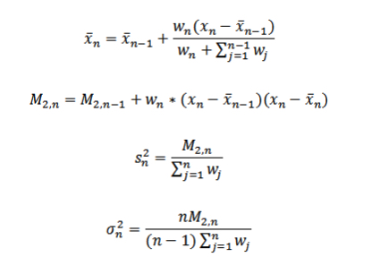
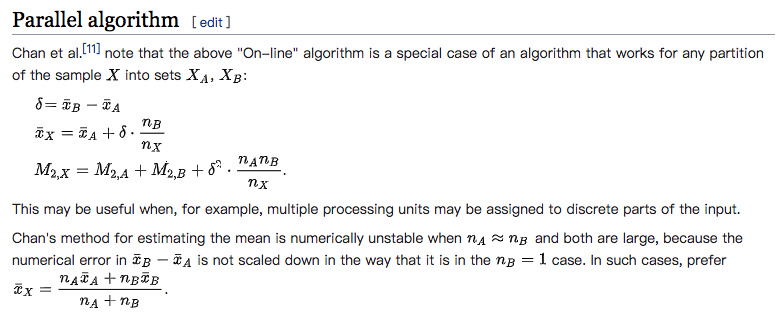

### Summary statistics 概括统计
#### 简介
为`RDD[Vector]`提供列的概括统计，通过调用`Statistics`的`colStats`方法。`colStats`方法返回`MultivariateStatisticalSummary`的实例，该实例包含列的最大值、最小值、平均值、方差、非0值的数量、以及总数(which contains the column-wise max, min, mean, variance, and number of nonzeros, as well as the total count.)。
```scala
import org.apache.spark.mllib.linalg.Vectors
import org.apache.spark.mllib.stat.{MultivariateStatisticalSummary, Statistics}

val observations = sc.parallelize(
  Seq(
    Vectors.dense(1.0, 10.0, 100.0),
    Vectors.dense(2.0, 20.0, 200.0),
    Vectors.dense(3.0, 30.0, 300.0)
  )
)

// Compute column summary statistics.
val summary: MultivariateStatisticalSummary = Statistics.colStats(observations)
println(summary.mean)  // a dense vector containing the mean value for each column
println(summary.variance)  // column-wise variance
println(summary.numNonzeros)  // number of nonzeros in each column
```
详见`examples/src/main/scala/org/apache/spark/examples/mllib/SummaryStatisticsExample.scala`

console:
```text
[2.0,20.0,200.0]
[1.0,100.0,10000.0]
[3.0,3.0,3.0]
```
#### 解析：
`Statistics`
```scala
 /**
   * Computes column-wise summary statistics for the input RDD[Vector].
   * 构造RowMatrix(分布式矩阵)，调用computeColumnSummaryStatistics方法
   * @param X an RDD[Vector] for which column-wise summary statistics are to be computed.
   * @return [[MultivariateStatisticalSummary]] object containing column-wise summary statistics.
   */
  @Since("1.1.0")
  def colStats(X: RDD[Vector]): MultivariateStatisticalSummary = {
    new RowMatrix(X).computeColumnSummaryStatistics()
  }
```
`RowMatrix`
```scala
 /**
   * Computes column-wise summary statistics.
   * rows: RDD[Vector]，也就是上面的X
   * treeAggregate: 与[[org.apache.spark.rdd.RDD#aggregate]]语义相同，先对分区partition内的data进行add，再通过merge合并分区
   * 
   */
  @Since("1.0.0")
  def computeColumnSummaryStatistics(): MultivariateStatisticalSummary = {
    val summary = rows.treeAggregate(new MultivariateOnlineSummarizer)(
      (aggregator, data) => aggregator.add(data),
      (aggregator1, aggregator2) => aggregator1.merge(aggregator2))
    updateNumRows(summary.count)
    summary
  }
```
`MultivariateOnlineSummarizer`

想看懂`MultivariateOnlineSummarizer`，请先阅读[Algorithms for calculating variance](https://en.wikipedia.org/wiki/Algorithms_for_calculating_variance)

`add`方法，处理单partition内的数据，计算均值、方差。公式如下:
- 在线算法(避免内存占用过大，以及数值溢出等)
<div  align="center"></div>

- `Weighted incremental algorithm`加权增量算法
<div  align="center"></div>

```scala
 /**
   * Add a new sample to this summarizer, and update the statistical summary.
   *
   * @param sample The sample in dense/sparse vector format to be added into this summarizer.
   * @return This MultivariateOnlineSummarizer object.
   */
  @Since("1.1.0")
  def add(sample: Vector): this.type = add(sample, 1.0)

  private[spark] def add(instance: Vector, weight: Double): this.type = {
    require(weight >= 0.0, s"sample weight, ${weight} has to be >= 0.0")
    if (weight == 0.0) return this

    if (n == 0) {
      require(instance.size > 0, s"Vector should have dimension larger than zero.")
      n = instance.size

      currMean = Array.ofDim[Double](n)
      currM2n = Array.ofDim[Double](n)
      currM2 = Array.ofDim[Double](n)
      currL1 = Array.ofDim[Double](n)
      weightSum = Array.ofDim[Double](n)
      nnz = Array.ofDim[Long](n)
      currMax = Array.fill[Double](n)(Double.MinValue)
      currMin = Array.fill[Double](n)(Double.MaxValue)
    }

    require(n == instance.size, s"Dimensions mismatch when adding new sample." +
      s" Expecting $n but got ${instance.size}.")

    val localCurrMean = currMean
    val localCurrM2n = currM2n
    val localCurrM2 = currM2
    val localCurrL1 = currL1
    val localWeightSum = weightSum
    val localNumNonzeros = nnz
    val localCurrMax = currMax
    val localCurrMin = currMin
    instance.foreachActive { (index, value) =>
      if (value != 0.0) {
        if (localCurrMax(index) < value) {
          localCurrMax(index) = value
        }
        if (localCurrMin(index) > value) {
          localCurrMin(index) = value
        }

        val prevMean = localCurrMean(index)
        val diff = value - prevMean
        localCurrMean(index) = prevMean + weight * diff / (localWeightSum(index) + weight)
        localCurrM2n(index) += weight * (value - localCurrMean(index)) * diff
        localCurrM2(index) += weight * value * value
        localCurrL1(index) += weight * math.abs(value)

        localWeightSum(index) += weight
        localNumNonzeros(index) += 1
      }
    }

    totalWeightSum += weight
    weightSquareSum += weight * weight
    totalCnt += 1
    this
  }
```
`MultivariateOnlineSummarizer`

`merge`方法合并partitions，使用`Parallel algorithm`并行算法，如图:
<div  align="center"></div>

```scala
 /**
   * Merge another MultivariateOnlineSummarizer, and update the statistical summary.
   * (Note that it's in place merging; as a result, `this` object will be modified.)
   *
   * @param other The other MultivariateOnlineSummarizer to be merged.
   * @return This MultivariateOnlineSummarizer object.
   */
  @Since("1.1.0")
  def merge(other: MultivariateOnlineSummarizer): this.type = {
    if (this.totalWeightSum != 0.0 && other.totalWeightSum != 0.0) {
      require(n == other.n, s"Dimensions mismatch when merging with another summarizer. " +
        s"Expecting $n but got ${other.n}.")
      totalCnt += other.totalCnt
      totalWeightSum += other.totalWeightSum
      weightSquareSum += other.weightSquareSum
      var i = 0
      while (i < n) {
        val thisNnz = weightSum(i)
        val otherNnz = other.weightSum(i)
        val totalNnz = thisNnz + otherNnz
        val totalCnnz = nnz(i) + other.nnz(i)
        if (totalNnz != 0.0) {
          val deltaMean = other.currMean(i) - currMean(i)
          // merge mean together
          currMean(i) += deltaMean * otherNnz / totalNnz
          // merge m2n together
          currM2n(i) += other.currM2n(i) + deltaMean * deltaMean * thisNnz * otherNnz / totalNnz
          // merge m2 together
          currM2(i) += other.currM2(i)
          // merge l1 together
          currL1(i) += other.currL1(i)
          // merge max and min
          currMax(i) = math.max(currMax(i), other.currMax(i))
          currMin(i) = math.min(currMin(i), other.currMin(i))
        }
        weightSum(i) = totalNnz
        nnz(i) = totalCnnz
        i += 1
      }
    } else if (totalWeightSum == 0.0 && other.totalWeightSum != 0.0) {
      this.n = other.n
      this.currMean = other.currMean.clone()
      this.currM2n = other.currM2n.clone()
      this.currM2 = other.currM2.clone()
      this.currL1 = other.currL1.clone()
      this.totalCnt = other.totalCnt
      this.totalWeightSum = other.totalWeightSum
      this.weightSquareSum = other.weightSquareSum
      this.weightSum = other.weightSum.clone()
      this.nnz = other.nnz.clone()
      this.currMax = other.currMax.clone()
      this.currMin = other.currMin.clone()
    }
    this
  }
```
```scala
 /**
   * Sample mean of each dimension.
   *
   */
  @Since("1.1.0")
  override def mean: Vector = {
    require(totalWeightSum > 0, s"Nothing has been added to this summarizer.")

    val realMean = Array.ofDim[Double](n)
    var i = 0
    while (i < n) {
      realMean(i) = currMean(i) * (weightSum(i) / totalWeightSum)
      i += 1
    }
    Vectors.dense(realMean)
  }

  /**
   * Unbiased estimate of sample variance of each dimension.
   *
   */
  @Since("1.1.0")
  override def variance: Vector = {
    require(totalWeightSum > 0, s"Nothing has been added to this summarizer.")

    val realVariance = Array.ofDim[Double](n)

    val denominator = totalWeightSum - (weightSquareSum / totalWeightSum)

    // Sample variance is computed, if the denominator is less than 0, the variance is just 0.
    if (denominator > 0.0) {
      val deltaMean = currMean
      var i = 0
      val len = currM2n.length
      while (i < len) {
        // We prevent variance from negative value caused by numerical error.
        realVariance(i) = math.max((currM2n(i) + deltaMean(i) * deltaMean(i) * weightSum(i) *
          (totalWeightSum - weightSum(i)) / totalWeightSum) / denominator, 0.0)
        i += 1
      }
    }
    Vectors.dense(realVariance)
  }
```

#### 参考文献
[1] [Basic Statistics - RDD-based API - Summary statistics](http://spark.apache.org/docs/latest/mllib-statistics.html#summary-statistics)

[2] [endymecy's github](https://github.com/endymecy/spark-ml-source-analysis/blob/master/%E5%9F%BA%E6%9C%AC%E7%BB%9F%E8%AE%A1/summary-statistics.md)

[3] [Algorithms for calculating variance](https://en.wikipedia.org/wiki/Algorithms_for_calculating_variance)

[4] [Updating mean and variance estimates: an improved method](http://people.xiph.org/~tterribe/tmp/homs/West79-_Updating_Mean_and_Variance_Estimates-_An_Improved_Method.pdf)

[5] [Weighted arithmetic mean](https://en.wikipedia.org/wiki/Weighted_arithmetic_mean)

