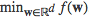
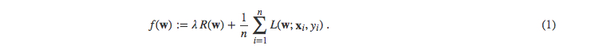
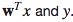
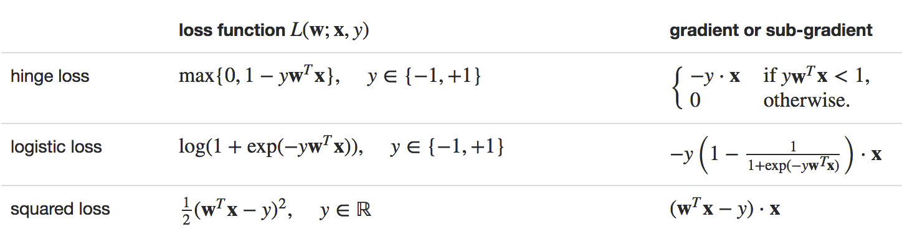

# Linear Methods(线性方法)
---
- <a href="#mathematical-formulation">Mathematical formulation(数学公式)</a>
    - <a href="#loss-functions">Loss functions(损失函数)</a>
    - <a href="#regularizers">Regularizers(正则化)</a>
    - <a href="#optimization">Optimization(优化)</a>
- <a href="#classification">Classification(分类)</a>
    - <a href="#svm">Linear Support Vector Machines (SVMs)支持向量机</a>
    - <a href="#logistic-regression">Logistic regression(逻辑回归)</a>
- <a href="#regression">Regression(回归)</a>
    - <a href="#linear-least-squares_lasso_ridge-regression">Linear least squares, Lasso, and ridge regression(线性最小二乘，套索和岭回归)</a>
    - <a href="#streaming-linear-regression">Streaming linear regression(流式线性回归)</a>
- <a href="#implementation-developer">Implementation (developer)(实施 开发者)</a>

### <a id="mathematical-formulation">Mathematical formulation(数学公式)</a>
许多标准的机器学习算法可以公式化为凸优化问题(`convex optimization problem`),例如找到凸函数*f*，该函数依赖于可变向量**w** (spark源码里一般称为`weight`),有`d`个`entries`。通常，我们可将其写为优化问题
 ,具体函数为：

这里向量`xi∈ℝd`是训练数据样本，且`1 <= i <= n`，`yi∈ℝ`是相应的标签，我们想预测他。如果`L(w;x,y)`可以表示为
的函数，我们称这个方法是线性的。好几个` spark.mllib`的分类、回归算法可以被归于这一类，这里都会讨论。

目标函数*f*有两个部分: 控制模型复杂度的`regularizer`, 度量(measure)训练数据的模型上的错误的损失函数`loss`。损失函数`L(w;.)`是典型的`w`上的凸函数。固定正则化的参数 `λ≥0` (regParam in the code) 定义了两个目标的权衡: 最小化损失(例如训练误差)，最小化模型复杂度(例如避免过度拟合)。

##### <a id="loss-functions">Loss functions(损失函数)</a>
下面的表格总结了`spark.mllib`中的损失函数和他们的梯度、子梯度:

注意，上面的数学公式中，二元标签`y`表示为+1或-1，方便于公式。然而，负标签在`spark.mllib`中表示为0而不是-1，与多类标签保持一致(to be consistent with multiclass labeling).

