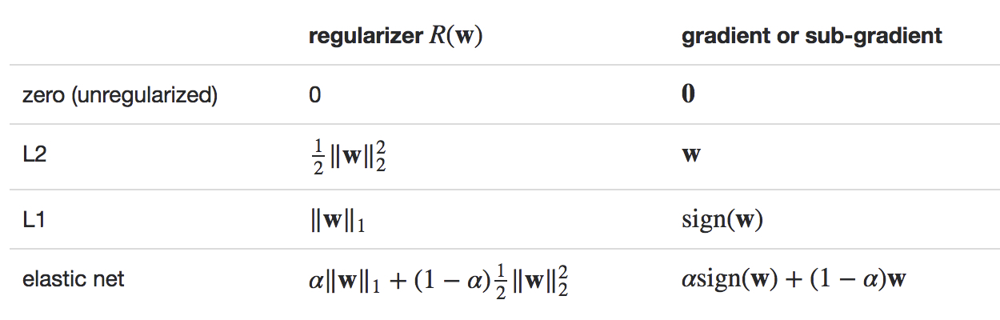
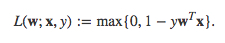

# Linear Methods(线性方法)
---
- <a href="#mathematical-formulation">Mathematical formulation(数学公式)</a>
    - <a href="#loss-functions">Loss functions(损失函数)</a>
    - <a href="#regularizers">Regularizers(正则化)</a>
    - <a href="#optimization">Optimization(优化)</a>
- <a href="#classification">Classification(分类)</a>
    - <a href="#svm">Linear Support Vector Machines (SVMs)支持向量机</a>
    - <a href="#logistic-regression">Logistic regression(逻辑回归)</a>
- <a href="#regression">Regression(回归)</a>
    - <a href="#linear-least-squares_lasso_ridge-regression">Linear least squares, Lasso, and ridge regression(线性最小二乘，套索和岭回归)</a>
    - <a href="#streaming-linear-regression">Streaming linear regression(流式线性回归)</a>
- <a href="#implementation-developer">Implementation (developer)(实施 开发者)</a>

### <a id="mathematical-formulation">Mathematical formulation(数学公式)</a>
---
许多标准的机器学习算法可以公式化为凸优化问题(`convex optimization problem`),例如找到凸函数*f*，该函数依赖于可变向量**w** (spark源码里一般称为`weight`),有`d`个`entries`。通常，我们可将其写为优化问题
 ,具体函数为：
<a id="function1"><div  align="center"></div></a>

这里向量`xi∈ℝd`是训练数据样本，且`1 <= i <= n`，`yi∈ℝ`是相应的标签，我们想预测他。如果`L(w;x,y)`可以表示为
的函数，我们称这个方法是线性的。好几个` spark.mllib`的分类、回归算法可以被归于这一类，这里都会讨论。

目标函数*f*有两个部分: 控制模型复杂度的`regularizer`, 度量(measure)训练数据的模型上的错误的损失函数`loss`。损失函数`L(w;.)`是典型的`w`上的凸函数。固定正则化的参数 `λ≥0` (regParam in the code) 定义了两个目标的权衡: 最小化损失(例如训练误差)，最小化模型复杂度(例如避免过度拟合)。

##### <a id="loss-functions">Loss functions(损失函数)</a>
下面的表格总结了`spark.mllib`中的损失函数和他们的梯度、子梯度:
<div  align="center"></div>

注意，上面的数学公式中，二元标签`y`表示为+1或-1，方便于公式。然而，负标签在`spark.mllib`中表示为0而不是-1，与多类标签保持一致(to be consistent with multiclass labeling).

##### <a id="regularizers">Regularizers(正则化)</a>
[正则化](http://en.wikipedia.org/wiki/Regularization_(mathematics))的目的，是促进简单的模型和避免过度拟合,`spark.mllib`支持以下的[正则化](http://kubicode.me/2015/09/05/Machine%20Learning/Regularization/)：
<div  align="center"></div>

sign(**w**)是一个向量，它由**w**中的所有实体(entries)的signs(±1)组成.

L2-正则问题通常比L1-正则更容易，因为它平滑。然而，L1-正则可以促进权重的稀疏，导致更小、更可解释的模型，后者对特征选择有用。[Elastic net](http://en.wikipedia.org/wiki/Elastic_net_regularization)是L1、L2正则的联合。不推荐不使用任何正则来训练模型，尤其是训练样本很少的时候。

##### <a id="optimization">Optimization(优化)</a>
在底层，线性方法使用凸优化方法来优化目标函数。`spark.mllib`使用两个方法,`SGD`、`L-BFGS`，在[优化](../optimization/index.md)一章会讲。当前，大多数算法API支持随机梯度下降(`SGD`),少数支持`L-BFGS`。参考[优化](http://spark.apache.org/docs/latest/mllib-optimization.html#Choosing-an-Optimization-Method)一节，了解优化方法选择的指导原则。


### <a id="classification">Classification(分类)</a>
---
[分类](http://en.wikipedia.org/wiki/Statistical_classification)的目的在于把数据分到不同的分类去。常用的分类为[二分类](http://en.wikipedia.org/wiki/Binary_classification),有两个分类，通常称为正负。如果多余两个分类，称为[多分类](http://en.wikipedia.org/wiki/Multiclass_classification)。`spark.mllib`支持两种线性方法做分类，线性支持向量机(SVMs)和逻辑回归。线性SVMs只支持二分类，逻辑回归支持二分类和多分类。


##### <a id="svm">Linear Support Vector Machines (SVMs)支持向量机</a>
[linear SVM](http://en.wikipedia.org/wiki/Support_vector_machine#Linear_SVM)是大规模分类任务的标准方法,正如上述<a href="#function1">方程(1)</a>所述，它是一个线性方法。它的损失函数是合页损失(hinge loss)，如下：
<div  align="center"></div>
默认情况下，线性支持向量机使用L2正则训练。也提供可选的L1正则。在这种情况下，这个问题变成[线性编程](http://en.wikipedia.org/wiki/Linear_programming)

线性SVMs算法输出一个SVM模型。给定一个新数据点，用**x**表示，这个模型基于`w^Tx`的值做预测。默认，如果`w^Tx`≥0，输出就是正，否则就是负

####### 示例
下面代码表示，如何加载样本数据集。使用算法对象中的静态方法对训练数据进行训练算法。使用生成的模型进行预测，以计算训练误差。

可參考[SVMWithSGD Scala docs](http://spark.apache.org/docs/latest/api/scala/index.html#org.apache.spark.mllib.classification.SVMWithSGD),[SVMModel Scala docs](http://spark.apache.org/docs/latest/api/scala/index.html#org.apache.spark.mllib.classification.SVMModel)了解api详情。
```scala
package org.apache.spark.examples.mllib

import org.apache.spark.{SparkConf, SparkContext}
// $example on$
import org.apache.spark.mllib.classification.{SVMModel, SVMWithSGD}
import org.apache.spark.mllib.evaluation.BinaryClassificationMetrics
import org.apache.spark.mllib.util.MLUtils
// $example off$

object SVMWithSGDExample {

  def main(args: Array[String]): Unit = {
    val conf = new SparkConf().setAppName("SVMWithSGDExample").setMaster("local")
    val sc = new SparkContext(conf)

    // $example on$
    // Load training data in LIBSVM format.
    /**
      * 1 125:26 126:240 127:72 153:25 ...
        0 155:62 156:91 157:213 158:255 ...
        1 157:42 158:228 159:253 160:253 ...
        1 128:62 129:254 130:213 156:102 ...
      */
    val data = MLUtils.loadLibSVMFile(sc, "data/mllib/sample_libsvm_data.txt")

    // Split data into training (60%) and test (40%).
    val splits = data.randomSplit(Array(0.6, 0.4), seed = 11L)
    val training = splits(0).cache()
    val test = splits(1)

    // Run training algorithm to build the model
    val numIterations = 100
    val model = SVMWithSGD.train(training, numIterations)

    // Clear the default threshold.
    model.clearThreshold()

    // Compute raw scores on the test set.
    val scoreAndLabels = test.map { point =>
      val score = model.predict(point.features)
      (score, point.label)
    }

    // Get evaluation metrics.
    val metrics = new BinaryClassificationMetrics(scoreAndLabels)
    val auROC = metrics.areaUnderROC()

    println(s"Area under ROC = $auROC")

    // Save and load model
    model.save(sc, "target/tmp/scalaSVMWithSGDModel")
    val sameModel = SVMModel.load(sc, "target/tmp/scalaSVMWithSGDModel")
    // $example off$

    sc.stop()
  }
}
```

```text
Area under ROC = 1.0
{"class":"org.apache.spark.mllib.classification.SVMModel","version":"1.0","numFeatures":692,"numClasses":2}
```
详见`examples/src/main/scala/org/apache/spark/examples/mllib/SVMWithSGDExample.scala`

`SVMWithSGD.train()`方法默认使用L2正则，正则参数设为1.0。如果我们想配置算法，可以通过直接创建新对象并调用setter方法进一步定制`SVMWithSGD`。所有其他`spark.mllib`算法也支持这种定制方式。例如，以下代码生成`SVMs`的L1正则，正则参数设为0.1，运行训练算法200个迭代。
```scala
import org.apache.spark.mllib.optimization.L1Updater

val svmAlg = new SVMWithSGD()
svmAlg.optimizer
  .setNumIterations(200)
  .setRegParam(0.1)
  .setUpdater(new L1Updater)
val modelL1 = svmAlg.run(training)
```

##### <a id="logistic-regression">Logistic regression(逻辑回归)</a>


- <a href="#regression">Regression(回归)</a>
    - <a href="#linear-least-squares_lasso_ridge-regression">Linear least squares, Lasso, and ridge regression(线性最小二乘，套索和岭回归)</a>
    - <a href="#streaming-linear-regression">Streaming linear regression(流式线性回归)</a>
- <a href="#implementation-developer">Implementation (developer)(实施 开发者)</a>