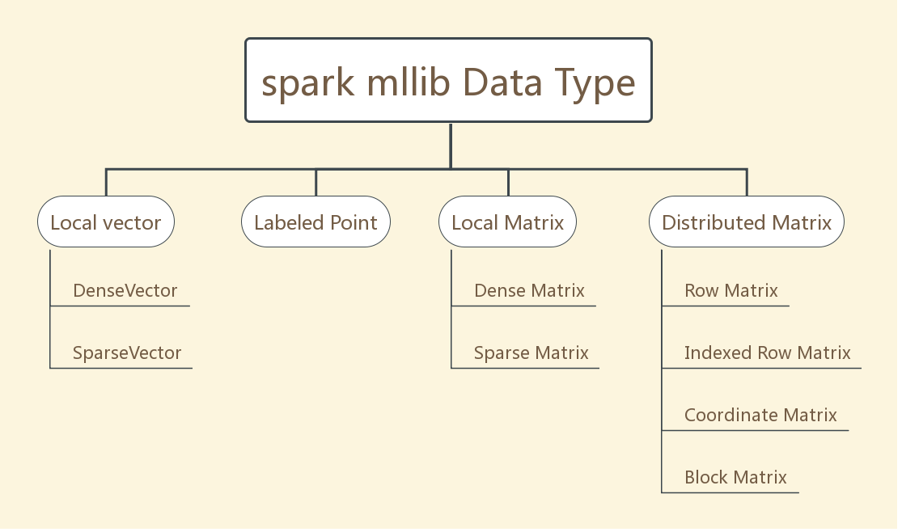
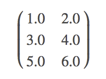

### DATA TYPE
`spark mlib`支持存储在单机器上的本地向量、本地矩阵，也支持备份在一个或多个`RDD`中的分布式矩阵。底层的线性代数由[Breeze](http://www.scalanlp.org/)提供。`mllib`中，用于有监督学习(supervised learning)的训练样本被称为训练样本(`labeled point`)

如上图所示，spark有如下几种数据类型：
- <a href="#local-vector">本地变量(local vector)</a>
    - dense vector(稠密向量) 
    - sparse vector(稀疏向量) 
- <a href="#labeled-point">labeled point(标注点)</a>
- <a href="#local-matrix">local matrix(本地矩阵)</a>
    - 稠密矩阵
    - 稀疏矩阵
- <a href="#distributed-matrix">distributed matrix(分布式矩阵)</a>
    - <a href="#row-matrix">Row Matrix</a>
    - <a href="#indexed-row-matrix">Indexed Row Matrix</a>
    - <a href="#coordinate-matrix">Coordinate Matrix(坐标矩阵)</a>
    - <a href="#block-matrix">Block Matrix</a>

#### <a id="local-vector">Local vector</a>
本地变量有从0开始的`integer`型索引和`double`型的值，存储在单机器上。`mllib`有两种本地向量：稀疏向量、稠密向量。推荐使用`Vectors`里的工厂方法创建本地向量。
```scala
import org.apache.spark.mllib.linalg.{Vector, Vectors}

//所谓稠密向量，是指0值与非0值都被保存，占用空间较大
// Create a dense vector (1.0, 0.0, 3.0).
val dv: Vector = Vectors.dense(1.0, 0.0, 3.0)
//所谓稀疏向量，是指只保存非0值，节约空间
//3指向量大小，0是1.0的索引，2是3.0的索引(索引0的值为0.0)
// Create a sparse vector (1.0, 0.0, 3.0) by specifying its indices and values corresponding to nonzero entries.
val sv1: Vector = Vectors.sparse(3, Array(0, 2), Array(1.0, 3.0))
// Create a sparse vector (1.0, 0.0, 3.0) by specifying its nonzero entries.
val sv2: Vector = Vectors.sparse(3, Seq((0, 1.0), (2, 3.0)))

```
稠密向量与稀疏向量可以相互转换：DenseVector -- toSparse --> SparseVector, SparseVector -- toDense --> DenseVector

#### <a id="labeled-point">Local vector</a>
标注点是一个本地向量(稀疏或稠密),与一个label或response相关联。在`MLlib`中，标注点用于有监督学习算法。我们用一个double存储标签，这样我们就可以在回归和分类(regression and classification)中使用标注点。 对于二分类，一个标签可能是0或者是1；对于多分类，一个标签可能代表从0开始的类别索引。
```scala
@Since("2.0.0")
@BeanInfo
case class LabeledPoint(@Since("2.0.0") label: Double, @Since("2.0.0") features: Vector) {
  override def toString: String = {
    s"($label,$features)"
  }
}
```
```scala
import org.apache.spark.mllib.linalg.Vectors
import org.apache.spark.mllib.regression.LabeledPoint

// Create a labeled point with a positive label and a dense feature vector.
val pos = LabeledPoint(1.0, Vectors.dense(1.0, 0.0, 3.0))

// Create a labeled point with a negative label and a sparse feature vector.
val neg = LabeledPoint(0.0, Vectors.sparse(3, Array(0, 2), Array(1.0, 3.0)))
```
在实践中使用稀疏的训练数据非常普遍。MLlib支持读取存储为LIBSVM格式的训练样本，他是[LIBSVM](http://www.csie.ntu.edu.tw/~cjlin/libsvm/)和[LIBLINEAR](http://www.csie.ntu.edu.tw/~cjlin/liblinear/).他是一种文本格式，每一行使用以下的格式表示被标注的稀疏特征向量(a labeled sparse feature vector)
```text
label index1:value1 index2:value2 ...
```
这种格式里，索引以1开始，且升序。装载后，特征索引被转换为以0开始。


`MLUtils.loadLibSVMFile`读取存储为LIBSVM格式的训练集
```scala
import org.apache.spark.mllib.regression.LabeledPoint
import org.apache.spark.mllib.util.MLUtils
import org.apache.spark.rdd.RDD

val examples: RDD[LabeledPoint] = MLUtils.loadLibSVMFile(sc, "data/mllib/sample_libsvm_data.txt")
```

#### <a id="local-matrix">Local matrix</a>
本地向量有`integer`型的行、列索引，以及`double`型的值，存储在单台机器上。MLlib支持稠密矩阵，entry value以列的顺序(column-major)存储在一个double数组中；也支持稀疏矩阵，非0的entry value以CSC(Compressed Sparse Column 压缩稀疏列)格式、列顺序(column-major)存储.例如，下面的稠密矩阵



被存储在一维数组` [1.0, 3.0, 5.0, 2.0, 4.0, 6.0]`,矩阵大小为(3, 2)

本地矩阵的基类为`Matrix`，提供了`DenseMatrix`和`SparseMatrix`两种实现。推荐使用` Matrices`的工厂方法创建本地向量。记住，MLlib里的本地向量以`column-major`的顺序存储。
```scala
import org.apache.spark.mllib.linalg.{Matrix, Matrices}

// Create a dense matrix ((1.0, 2.0), (3.0, 4.0), (5.0, 6.0))
val dm: Matrix = Matrices.dense(3, 2, Array(1.0, 3.0, 5.0, 2.0, 4.0, 6.0))

// Create a sparse matrix ((9.0, 0.0), (0.0, 8.0), (0.0, 6.0))
val sm: Matrix = Matrices.sparse(3, 2, Array(0, 1, 3), Array(0, 2, 1), Array(9, 6, 8))
```
稀疏矩阵、稠密矩阵可相互转化
SparseMatrix -- toDense --> DenseMatrix, DenseMatrix -- toSparse --> SparseMatrix
关于CSC矩阵，详见[稀疏矩阵存储格式总结+存储效率对比:COO,CSR,DIA,ELL,HYB](http://www.cnblogs.com/xbinworld/p/4273506.html)

#### <a id="distributed-matrix">Distributed matrix</a>
分布式矩阵有`long`型的行列索引，`double`型的值，分布式的存储在一个或多个`RDD`中。选择正确的格式存储大的、分布式的矩阵非常重要。把分布式矩阵转化为不同的格式可能需要全局的`shuffle`，这很昂贵。目前有4种分布式矩阵。

- `Row Matrix`:面向行(row-oriented)的分布式矩阵，没有有意义的行索引，例如，特征向量的集合。他的行(rows)保存为一个`RDD`，每一行都是一个本地向量。假设一个`Row Matrix`的列不大，这样一个单个的本地向量可以方便的和`driver`通信，且可以使用一个单节点存储和使用。
- `IndexedRowMatrix`与`Row Matrix`相似，但是有行索引，行索引可用来识别行并执行joins(executing joins).
- `CoordinateMatrix`，以[coordinate list(COO)](https://en.wikipedia.org/wiki/Sparse_matrix#Coordinate_list_.28COO.29)格式存储，entries存储在RDD里。元素为
```scala
case class MatrixEntry(i: Long, j: Long, value: Double)
```
- `BlockMatrix`是一个分布式矩阵，由`MatrixBlock`构成`RDD`,是一个(Int, Int, Matrix)的tuple。included set of matrix block (row_index, col_index, matrix)

**_Note_**
分布式矩阵的基础RDD必须是确定性的，因为我们缓存矩阵大小。 通常，使用非确定性RDD可能导致错误。
##### <a id="row-matrix">RowMatrix</a>
`RowMatrix`是面向行的分布式矩阵，没有有意义的行索引，行被保存为`RDD`,每一行都是一个本地向量。因此，列数被限制在`integer`范围内，但实际中，列数会小的多

`Rowmatrix`从`RDD[Vector]`实例创建。然后可以计算列的统计和分解，[QR分解](https://en.wikipedia.org/wiki/QR_decomposition)的形式为`A=QR`，Q是正交矩阵，R是上三角矩阵。想了解奇异值分解[singular value decomposition (SVD)](https://en.wikipedia.org/wiki/Singular_value_decomposition)和主成分分析[principal component analysis (PCA)](https://en.wikipedia.org/wiki/Principal_component_analysis),请参考降维[Dimensionality reduction](http://spark.apache.org/docs/latest/mllib-dimensionality-reduction.html)

参考[RowMatrix Scala docs](http://spark.apache.org/docs/latest/api/scala/index.html#org.apache.spark.mllib.linalg.distributed.RowMatrix)了解api细节
```scala
import org.apache.spark.mllib.linalg.Vector
import org.apache.spark.mllib.linalg.distributed.RowMatrix

val rows: RDD[Vector] = ... // an RDD of local vectors
// Create a RowMatrix from an RDD[Vector].
val mat: RowMatrix = new RowMatrix(rows)

// Get its size.
val m = mat.numRows()
val n = mat.numCols()

// QR decomposition 
val qrResult = mat.tallSkinnyQR(true)
```

##### <a id="indexed-row-matrix">IndexedRowMatrix</a>
`IndexedRowMatrix`与`RowMatrix`相似，但是有有意义的行索引。由有索引的行(indexed rows)构成`RDD`,所以每一行都可以由索引(long型)和一个本地向量表示

`IndexedRowMatrix`可以通过`RDD[IndexedRow]`实例创建，`IndexedRow`是对(Long, Vector)的包装。一个`IndexedRowMatrix`可以通过放弃行索引转换成`RowMatrix`。
```scala
import org.apache.spark.mllib.linalg.distributed.{IndexedRow, IndexedRowMatrix, RowMatrix}

val rows: RDD[IndexedRow] = ... // an RDD of indexed rows
// Create an IndexedRowMatrix from an RDD[IndexedRow].
val mat: IndexedRowMatrix = new IndexedRowMatrix(rows)

// Get its size.
val m = mat.numRows()
val n = mat.numCols()

// Drop its row indices.
val rowMat: RowMatrix = mat.toRowMatrix()
```
```scala
case class IndexedRow(index: Long, vector: Vector)
```
##### <a id="coordinate-matrix">CoordinateMatrix</a>
`CoordinateMatrix`是一个分布式矩阵，`RDD`由entries组成，每个entry是一个(i: Long, j: Long, value: Double)的元组，i是行索引，j是列索引，value是entry的value。仅当matrix的两个维度都很大，且matrix非常稀疏，`Coordinatematrix`才应该被使用。

`CoordinateMatrix`可以通过`RDD[MatrixEntry]`创建，其中，`MatrixEntry`是(Long, Long, Double)的包装。`CoordinateMatrix`可以通过`toIndexedRowMatrix`方法转化为带有稀疏行的`IndexedRowMatrix`。其他计算当前尚未支持。
```scala
import org.apache.spark.mllib.linalg.distributed.{CoordinateMatrix, MatrixEntry}

val entries: RDD[MatrixEntry] = ... // an RDD of matrix entries
// Create a CoordinateMatrix from an RDD[MatrixEntry].
val mat: CoordinateMatrix = new CoordinateMatrix(entries)

// Get its size.
val m = mat.numRows()
val n = mat.numCols()

// Convert it to an IndexRowMatrix whose rows are sparse vectors.
val indexedRowMatrix = mat.toIndexedRowMatrix()
```
```scala
case class MatrixEntry(i: Long, j: Long, value: Double)
```
##### <a id="block-matrix">BlockMatrix</a>
`BlockMatrix`是由`RDD[MatrixBlock]`组成的分布式矩阵，`MatrixBlock`是`((Int, Int), Matrix)`构成的元组，`(Int, Int)`是块的索引，`Matrix`是给定索引位置的子矩阵(本地矩阵，稀疏或稠密)，大小为`rowsPerBlock x colsPerBlock`。`BlockMatrix`支持与另一个`BlockMatrix`的`add`或`multiply`方法。`BlockMatrix`也有一个帮助方法`validate`用来检测`BlockMatrix`是否被正确创建。

`BlockMatrix`最容易通过`IndexedRowMatrix`或`CoordinateMatrix`的`toBlockMatrix`方法创建。默认创建`1024 * 1024`大小的块(blocks).用户可以通过`toBlockMatrix(rowsPerBlock, colsPerBlock)`改变block的大小。
```scala
import org.apache.spark.mllib.linalg.distributed.{BlockMatrix, CoordinateMatrix, MatrixEntry}

val entries: RDD[MatrixEntry] = ... // an RDD of (i, j, v) matrix entries
// Create a CoordinateMatrix from an RDD[MatrixEntry].
val coordMat: CoordinateMatrix = new CoordinateMatrix(entries)
// Transform the CoordinateMatrix to a BlockMatrix
val matA: BlockMatrix = coordMat.toBlockMatrix().cache()

// Validate whether the BlockMatrix is set up properly. Throws an Exception when it is not valid.
// Nothing happens if it is valid.
matA.validate()

// Calculate A^T A.
val ata = matA.transpose.multiply(matA)
```

#### 参考文献
[spark Data Types - RDD-based API](http://spark.apache.org/docs/latest/mllib-data-types.html)

[endymecy's github](https://github.com/endymecy/spark-ml-source-analysis/blob/master/%E6%95%B0%E6%8D%AE%E7%B1%BB%E5%9E%8B/data-type.md)

[edium @rickynguyen](https://medium.com/@rickynguyen/getting-started-with-spark-day-5-36b62a6d13bf)

[稀疏矩阵存储格式总结+存储效率对比:COO,CSR,DIA,ELL,HYB](http://www.cnblogs.com/xbinworld/p/4273506.html)